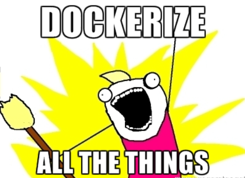

## Hello everyone. Here are the files and instructions to deploy Elastic, Kibana, Filebeat, and Suricata in a Docker container for class CIS320!!!
#### Step 1. Clone this repo using git clone
#### Step 2 Create a subdirectory like: mkdir elasticcontainer (It can be any name or you can use this name.)
#### Inside that directory copy and paste the files compose.yaml and filebeat.yml
#### Step 3 Rrun the command: sudo docker compose -up -d
#### Step 4 From the client machine, open web browser and navigate to: HTTP://ip of you Ubuntu Server:5601
#### Step 5 Enjoy..!!!
###### Improvements? Feel free to submit a pull request...!!

